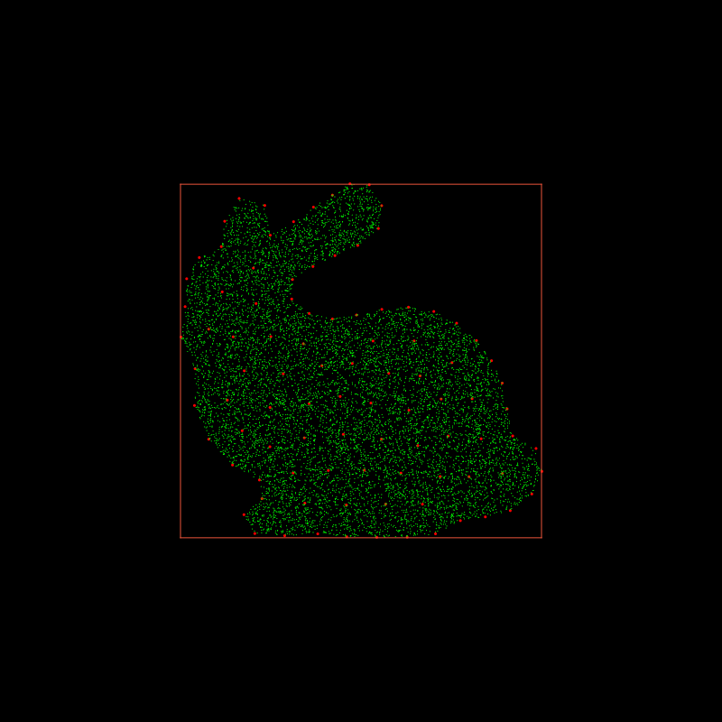
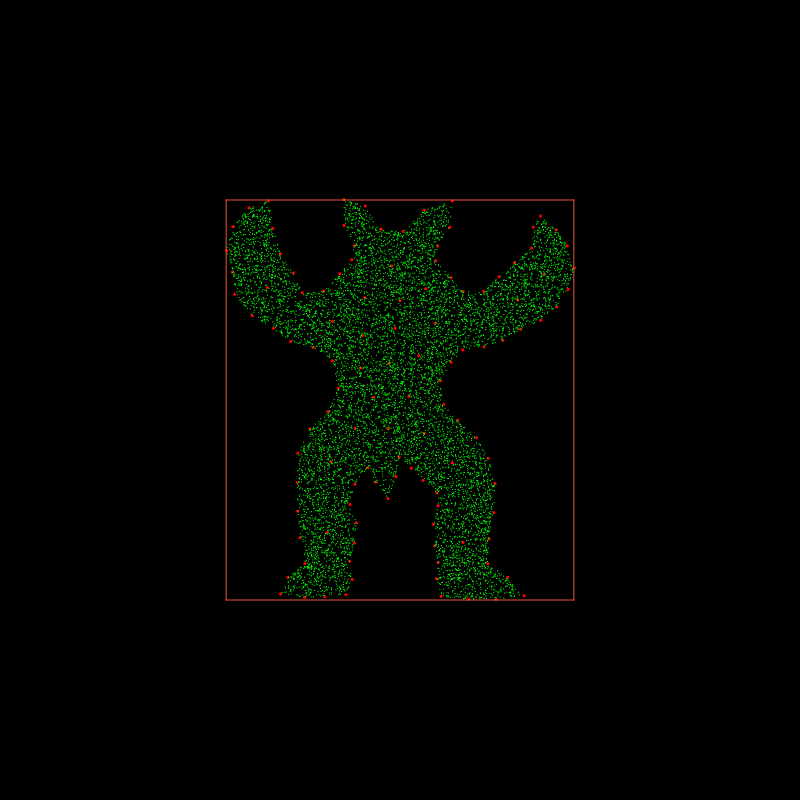
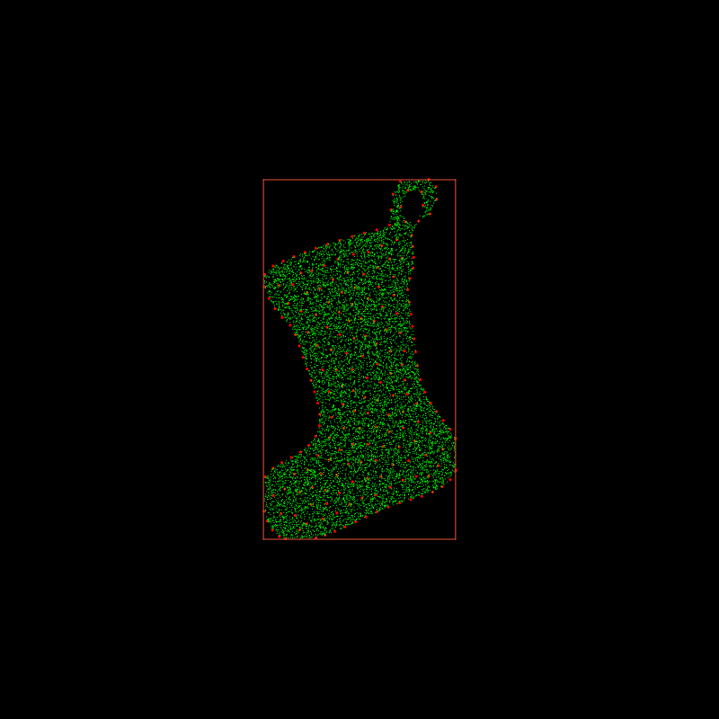

# generate_cloud_points

Given a 2D triangle mesh, we could randomly generate cloud points which fill in the triangle mesh.





# Run
`python disp_mesh.py`

# Triangle Mesh
We provides three tirangle meshes: **bunny**, **armadillo** and **christmas socks**.

## Triangle mesh format
```
numPoints 100
0.1 0.2
....
numTriangles 200
0 1 2
....
```

# Implementation details
1. Read the triangle mesh with `read_obj.py`
2. Find boundary edges using `find_boundary.py`
3. Generate random points `p` in the AABB of triangle mesh
4. Shoot a ray from `p` and count how many time the ray intersect with boundary edges
5. if the number of intersection is even, then the point `p` is outside the triangle mesh
6. Otherwise, the point `p` is inside the tirangle mesh
7. If `p` is inside the triangle mesh, we add into the final cloud points field (`ti.Vector.field`)
